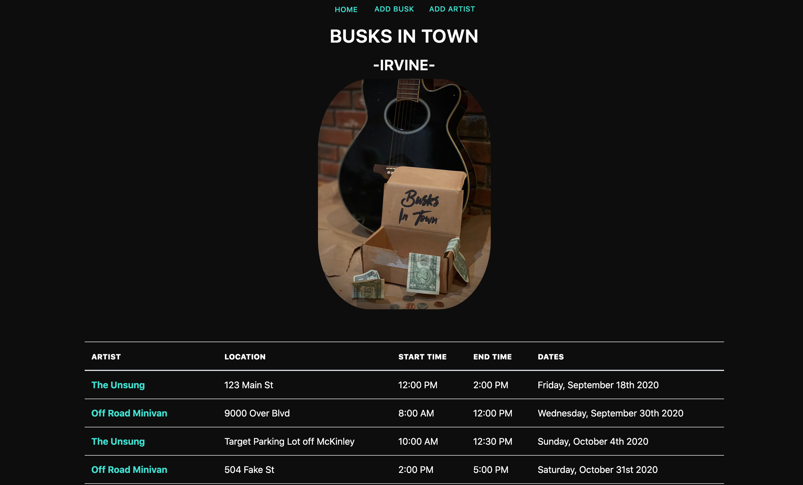
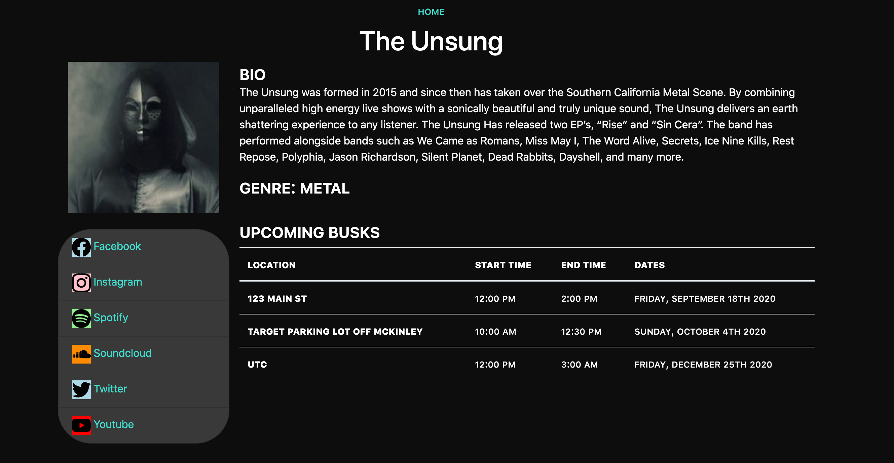

# BusksInTown

>### Group Project by:
>* Makoto Asahi
>* Devin Castro
>* Eric Park
>* Dave Trimboli
>* Kenny Yang

This application is deployed at : 

### Description:
This full stack application is a similar app to bands in town.  Any band, artist, or musician of any kind, can make an artist profile, and post a local busk wherever they want to perform.  Being in a pandemic and having music venues being closed has made it very difficult for musicians and artists to perform live.  You can always perform a busk on a street corner or outside of a local grocery store!  This app has created a unique and simple way to showcase your busks and your art with the community

## Technologies Used:
This full stack application uses, node.js and express to create the server.  We are using handlebars to render the front end.  We are using the bootstrap library to handle styling. We've implemented a new technology called animate.style to give us some front end animations.  We are using sequalize and mySQL2 to create our database.  Lastly we are using local storage to store a artist that a user creates on their local device.  This application is deployed through Heroku.  

## Usage:
To use this application, first create and artist profile that has all the correct information about that specific artist.  Once the artist profile is created, then you can make a busk for that specific artist.  Enter the proper busk infromation and the busk will be crteated and populate into the table, SORTED BY DATE.  To view the artist profile, simply click the name of the band in the table of busks, and it will take you to that bands profile.  On the profile page, you can see all the infromation about the band including, bio, genre, upcoming busks, and all the clickable social media links for that band.

